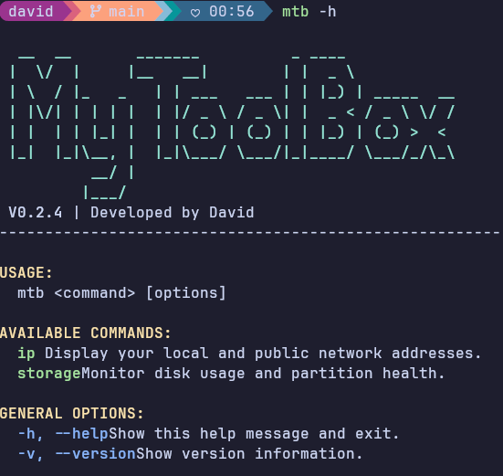

# MyToolBox (mtb)

A high-performance system utility for Arch Linux, built with C++ and direct POSIX system calls.

---

### Description
**MyToolBox** is a lightweight command-line interface (CLI) designed to provide instant system insights. Unlike shell-script alternatives, `mtb` interfaces directly with the Linux kernel via sockets and system headers, ensuring maximum speed and minimal resource footprint.

### Key Features
*   **Native Performance**: Compiled binary with zero overhead.
*   **Direct Networking**: Fetches local and public IP addresses using raw C sockets.
*   **Storage Analytics**: Filters out virtual filesystems to show real physical disk health and usage.
*   **Visual Precision**: Aligned terminal output with color-coded status alerts (OK/WARN/CRIT).


### Use
You can use the app with `mytoolbox` or `mtb`.

---



## Installation

### Prerequisites
Ensure you have the base development headers installed:
```bash

sudo pacman -S base-devel cmake
```

### Build and install

```bash

git clone [https://github.com/vaainci/MyToolBox.git](https://github.com/vaainci/MyToolBox.git)
cd MyToolBox
chmod +x install.sh
./install.sh

```

---
# Commands :

### Available Commands

| Command | Argument | Description | Output Style |
| :--- | :--- | :--- | :--- |
| `mtb` | `ip` | Shows Local IPv4 and Public IP | Color-coded (Green/Blue) |
| `mtb` | `storage` | Monitors physical disks and partitions | Progress bars & Health Status |
| `mtb` | `uptime` | Time elapsed since last boot | HH:MM format |
| `mtb` | `--help` | Opens the interactive help menu | ASCII Art & Clickable Link |
| `mtb` | `--version` | Displays the current build version | Semantic Versioning |